<!-- ============================================================
     PROFILE README: SubhamPro11
     The three SVG cards below are generated, not hand-drawn.
     Source: scripts/  ·  Workflow: .github/workflows/update-profile-art.yml
     ============================================================ -->

 
 

<code>AI &amp; Computer Vision Engineer · Full-stack builder · Prompt engineer</code>

 

## `01` · Contributions

<!-- real data from my public contribution calendar, rebuilt daily -->

 

## `02` · whoami

<!-- both cards are 840x880, so equal widths give equal heights -->
<table>
<tr>
<td valign="top"></td>
<td valign="top"></td>
</tr>
</table>

 

## `03` · About

- **AI / Computer Vision Engineer** and solo full-stack builder. Based in India · CSE, Parul University (Class of 2027)
- **Prompt engineering and AI power user**: I build with agentic workflows (spec'd, gated prompt documents executed step by step and reviewed before merging), not one-shot vibe coding
- **AWS Certified**: Cloud Foundations and Solutions Architecture
- Right now: hardening Crawlers' SEO and Core Web Vitals
- Open to collaborating on open-source AI tooling and full-stack web apps
- Fun fact: my best code runs after midnight

 

## `04` · Shipping

<table>
<tr>
  <th align="left">Project</th>
  <th align="left">What it is</th>
  <th align="left">Built with</th>
  <th align="left">Links</th>
</tr>
<tr>
  <td><b>Crawlers</b></td>
  <td>AI tools directory: 1,000+ tools across 45+ categories, organized by use case, not brand. My main project right now</td>
  <td>
    
    
    
  </td>
  <td><a href="https://crawlers.dpdns.org">Live</a></td>
</tr>
<tr>
  <td><b>AuraWalls</b></td>
  <td>Human-curated wallpaper discovery platform</td>
  <td>
    
    
  </td>
  <td><a href="https://aurawalls.qzz.io">Live</a></td>
</tr>
<tr>
  <td><b>Airwaves</b> formerly PlayIt</td>
  <td>Curated directory of 70+ independent web radio and soundscape projects. Zero ads, no algorithms</td>
  <td>
    
  </td>
  <td><a href="https://playit.morbius.workers.dev">Live</a></td>
</tr>
<tr>
  <td><b>LockscreenGif</b></td>
  <td>Windows 11 tool that sets animated GIFs and videos as the lock screen. I maintain this build of <a href="https://github.com/Leapward-Koex/LockscreenGif">Leapward-Koex's original</a>, with its own site</td>
  <td>
    
    
  </td>
  <td><a href="https://lockscreen-gtf-web.morbius.workers.dev">Live</a> · <a href="https://github.com/SubhamPro11/lockscreengtf">Source</a></td>
</tr>
</table>

All repos: <a href="https://github.com/SubhamPro11?tab=repositories">github.com/SubhamPro11?tab=repositories</a>

 

## `05` · Stack

**Languages**

  
  
  
  
  
  

**Frameworks &amp; libraries**

  
  
  
  
  
  

**AI, agents &amp; automation**

  
  
  
  
  
  

**Databases**

  
  
  

**Tools &amp; DevOps**

  
  
  
  

**Certifications**

  
  

 

## `06` · Connect

  
  
  
  
  
  

 
 

<code>$ ssh build with me_</code>

